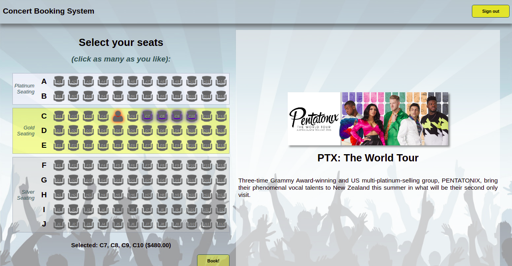

Project - A Concert Booking Service
==========

The aim of this project is to build a Web service for concert booking. 

System description
----------
A booking service is required for a small venue, with a capacity of 120 seats. The venue's seats are classified into three price bands, Silver, Gold and Platinum. A concert may run on multiple dates, and each concert has at least one performer. Additionally, a performer may feature in multiple concerts.

The service is to allow clients to retrieve information about concerts and performers, to make and enquire about seats and reservations, and to authenticate users.

When making a reservation, clients may enquire about available seats. They should be informed of any unbooked seats, along with their pricing. Clients may select any number of seats to book. When making a reservation request, double-bookings are not permitted. Only one client should be allowed to book a given seat for a given concert on a given date. Clients may not make partial bookings - either *all* of a client's selected seats are booked, or *none* of them are.

Clients may view concert and performer information, and enquire about available seating, whether or not they are authenticated. When authenticated, clients gain the ability to make reservations, and to view their own reservations. Clients should never be able to view the reservation information for other guests.

In addition, clients should be able to subscribe to information regarding concert bookings. Specifically, they should be able to subscribe to "watch" one or more concerts / dates, and be notified when those concerts / dates are about to sell out.

A particular quality attribute that the service must satisfy is scalability. It is expected that the service will experience high load when concert tickets go on sale. 

Appendix: The client webapp.
----------
The `concert-client` project contains a complete web application which is designed to communicate with your web service from both its server-side (Java) and client-side (JavaScript) code, to deliver its functionality.

#### App usage
Using the application, browsing to `/Concerts` or simply `/` (within the webapp's *context*) will present the "homepage" of the app, allowing the user to view concerts. On this page, users may scroll through the list of concerts on the left side of the page. Clicking on a concert will cause that concert's info to be displayed in the detail view.

On the detail view, users can see more information about the currently selected concert, as well as a list of performers and dates for that concert.

Clicking on a performer's image will display a modal dialog containing more information about that performer:

If the user hasn't logged in, then clicking on the "Book!" button next to one of a concert's dates will prompt the user to sign in:

If the user has already signed in, they will be redirected to the seat selection page for their selected concert and date. See `concert-service/src/main/resources/db-init.sql` for the data that the server is initialised with, including possible users and their passwords.

Here, users can see a visual seat map of the venue, along with an indicator of which seats have already been booked. Clicking unbooked seats will toggle a blue halo around that seat - an indicator that the seat has been selected for booking, as can be seen in the above screenshot. A list of selected seats - along with the total ticket price - can be seen below the seat map.

Once the user has made their selection, they can click the "Book!" button. Assuming they have "sufficient funds" (which will always be true for this test case), and that no other user has booked the same seats in the meantime, the user will be presented with a success dialog box:

Dismissing the dialog will redirect the user back to the concerts page, where they may continue to book tickets at other concerts / dates. (or more tickets for the same concert / date).

#### Limitations
The webapp currently *partially* exercises the web service you are required to create for this project. Functionality for a user to view their bookings is not implemented, though this is required by the web service specification. Additionally, the webapp does not participate in the *publish / subscribe* functionality required of the service.

#### Running the complete system
The only way to run the complete system is to package both the `client` and `service` projects into `WAR` files, and deploy them to a running servlet container such as Tomcat.

Fortunately, running Maven's `package` goal on the parent project will build both WARs as required. However, we will still need to set up a Tomcat (or similar) instance to run the application.

Whichever IDE you use, the first step will be to download a Tomcat installation, if you don't already have one. You can find them [here](https://tomcat.apache.org/download-80.cgi). Get version `8.5.x` as an archive (the installer isn't required), download and unzip it somewhere on your machine, and then follow the steps below according to your IDE.

**Warning** There seem to be a number of variations in IDE setup and installation, so what's below may not work for your particular setup. You may need to explore google to find workable alternatives. [Tomcat-CL](Tomcat-CL.md) has a simplified attempt for doing it from the command line.

#### From Eclipse
**Note: This only works with Eclipse for Java EE Developers, with Tomcat support enabled**. If you don't see any of the options mentioned here, it's likely that you don't have these options. You can get them through the *Help* &rarr; *Install new software* menu, searching for *Java EE* and *Tomcat*, respectively. Alternatively you could try using the 
[marketplace](https://marketplace.eclipse.org/content/eclipse-java-ee-developer-tools-0) directly.

1. Open *Window* &rarr; *Preferences*, then choose *Server* &rarr; *Runtime Environments*. Click *Add*, then choose the Apache Tomcat version matching the one you downloaded (which should be v8.5 if you're following along).

2. Click *Next*, then browse to where you unzipped Tomcat. Click *Select folder*, then *Apply and Close*.

3. Next, open the *run configurations* menu (the small dropdown arrow next to the green Play button). Locate *Apache Tomcat*, and double-click to create a new run configuration.

4. Go to the *Servers* View. if it's not on-screen, open it with *Window* &rarr; *Show view*. Create a new Tomcat server of matching version, and click *Finish*.

5. Right-click the newly created server, and choose *Open*. here, you can configure the *HTTP/1.1* port on the right (say, to 10000). Save the config (`Ctrl+s`).

6. In the above menu, you can also see / change the *Server path* and *Deploy path*. the default is something like `.metadata\.plugins\org.eclipse.wst.server.core\tmp0\wtpwebapps` - which you can use, or you can change it to anywhere on your machine. Again, save the config.

7. Run maven's `package` goal to create the WARs if you haven't already done so.

8. Rename the `client` WAR to `concert-webapp.war`, and the `server` WAR to `webservice.war`. This will prevent you from needing to make changes to `Config.java` and `fetch-api.js` in the `client` project. Alternatively, you may make the changes to these files as required.

9. Start the server running. (right-click it to get the option).

10. In a file explorer, browse to the server path / deploy path as in step 6 - except, locate the `webapps` folder, rather than `wtpwebapps`.

11. Copy / paste your WARs into the `webapps` folder. If the server is started, you should notice folders shortly being created by Tomcat. And, you can see Tomcat's logging output from the Eclipse console.

12. Browse to the appropriate URL from your browser (which should be <http://localhost:10000/concert-webapp/> if you've followed along), and enjoy.

13. When you make modifications and repackage your WARs, you can delete the contents of the `webapps` folder and re-copy your new WARs over (while the server is stopped).

#### From IntelliJ
**Note: This ONLY works in IntelliJ Ultimate edition.** Community edition does not support this. Having said that, Ultimate edition is available for free for educational use. Simply sign up for a new account using your University email address.

1. Within your project, open the *Run Configurations* dialog (usually available in the top-right corner, or open the search box by tapping double-shift, then type "run configurations"). Either way, pick *Edit Configurations*.

2. Click on the **+** button on the top-left of the dialog, then choose *Tomcat server* &rarr; *Local*.

3. Name the configuration whatever you like. For the *HTTP Port*, pick one which is available on your machine, such as *10000*.

4. For the *application server*, pick one from the list. If none are available, click *configure*. You'll be able to add one (by browsing to the location where you downloaded Tomcat earlier).

5. Under the *Deployment* tab, select both WAR artifacts (`client` and `service`) for deployment - these would have been created by IntelliJ's Maven integration (you shouldn't select the *exploded* versions, but it probably doesn't matter). For the application context, set the `service` WAR's context to `/webservice`, and the `client` WAR's context to `/concert-webapp`.

6. Go back to the *Server* tab. Edit the *URL* to be `http://localhost:10000/concert-webapp/` (altering the port as necessary). Then, click `OK`.

7. In the `client` project, open `src/main/java/.../Config.java`, and edit the `WEB_SERVICE_URI` field as appropriate (assuming port `10000`, and the contexts identified in step 5 above, you won't need to change this).

8. In the `client` project, open `src/main/webapp/js/fetch-api.js` and edit `WEB_URI` as appropriate (assuming the contexts identified in step 5 above, you won't need to change this).

9. From the *run configurations* dropdown, slect your new configuration and click the *play* button. The webapp and web service should start, and the browser should eventually open at the URL identified in step 6 above. If it doesn't, you can browse there manually.

10. When you're done, hit the *stop* button. Sometimes you may need to click it twice (do so until the stop button is greyed out, and you see a *Disconnected from server* message in the server output).
